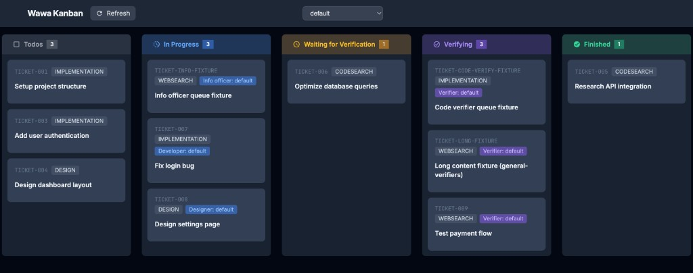

# Wawa Kanban

Wawa Kanban is a **file-backed** kanban UI for markdown tickets, plus CLI helpers to wire **OpenClaw agents** to the same workspace. Tickets live under `projects/` and `agents/`; the board merges project columns with per-agent queues (developers, designers, verifiers, etc.).



## Installation

The usual way to run the app is the **bootstrap** script below. **Clone the repo** if you want to run from source or hack on the code (see [Development](#development)).

### Quick install (bootstrap)

`install.sh` downloads the `wkanban` shell wrapper into `~/.wawa-kanban/bin` (symlinked to `~/.local/bin`) and runs **`wkanban init`**.

Requirements:

- `curl` or `wget`
- `docker` CLI and a reachable Docker Engine

`wkanban init` starts the Kanban container with:

- **`~/.wawa-kanban/workspace` → `/workspace`** in the container (`WAWA_WORKSPACE_PATH=/workspace`)
- **`~/.openclaw` → `/home/appuser/.openclaw`** so OpenClaw config and agent state stay on the host

It then runs **`uv run wkanban project add default -y`** and **`uv run wkanban agent add-default`** **inside** the container (no Python/`uv` required on the host for init).

```bash
curl -fsSL https://raw.githubusercontent.com/hex-hex/wawa-kanban/main/install.sh | sh
# or
wget -qO- https://raw.githubusercontent.com/hex-hex/wawa-kanban/main/install.sh | sh
```

When it finishes, open **http://localhost:5020**.

### From source (development)

**Prerequisites**

- Python 3.13+
- [uv](https://docs.astral.sh/uv/) (dependencies and running the app)
- Optional: **Node.js/npm** if you change UnoCSS / `cls` in Python and need to regenerate `static/uno.css`

```bash
git clone https://github.com/hex-hex/wawa-kanban.git
cd wawa-kanban
uv sync
uv run app.py
```

The app listens at **http://localhost:5020**.

---

## Development

### Workspace layout (what the UI reads)

- **Fixture workspace:** `fixtures/workspace` is sample data for local runs and tests. It is **not** in the published Docker image (`.dockerignore` excludes `fixtures/`).
- **Default in a git checkout:** if `WAWA_WORKSPACE_PATH` is unset, the app defaults to `fixtures/workspace`.
- **Production / Docker:** set `WAWA_WORKSPACE_PATH` to a directory that contains **`projects/`** and **`agents/`** (same layout as `~/.wawa-kanban/workspace` after init).

**Project tickets** (under `projects/<project_id>/`) use these **on-disk** column folders (names match `TicketStatus` values):

| Board column              | Directory under each project     |
|---------------------------|----------------------------------|
| Todos                     | `todos/`                         |
| Waiting for Verification  | `waiting_for_verification/`      |
| Finished                  | `finished/`                      |

**In Progress** and **Verifying** on the board are **not** separate folders inside the project tree. Those columns are built from tickets under:

- `agents/developers/<slot>/`, `agents/designers/<slot>/`, `agents/info-officers/<slot>/` (in progress; filtered by ticket **mode**)
- `agents/code-verifiers/<slot>/`, `agents/general-verifiers/<slot>/` (verifying; filtered by **mode**)

Tickets are markdown files with YAML frontmatter; filename pattern includes project id and mode (see [design.md](design.md)).

**Agent role docs** in this repo live under `agents/<role>/` as **`*.md.j2`** templates. When you register an agent, they are rendered to `*.md` in that agent’s OpenClaw workspace (paths/names get `kanban_slot` and related variables). Roles include `developer`, `designer`, `info-officer`, `code-verifier`, `general-verifier`, `lead`, and `project-manager`.

### CLI: `wkanban` (agents + projects)

From the repo (after `uv sync`), use **`uv run wkanban …`**. The installed shell `wkanban` runs **`init` / `uninstall`** without a clone; for **`agent`** / **`project`** it needs **`WAWA_KANBAN_ROOT`** pointing at this repo plus **`uv`** on the host (see `cli/wkanban`).

**Agents**

- Duplicate **agent id** (already in `openclaw.json`) → error, no changes.
- Interactive **`Proceed? [Y/n]`** before writing config and materializing the workspace; default **Yes**.
- **Non-interactive** (no TTY): pass **`--yes`** or the command fails with a hint.
- Optional **`--wawa-workspace DIR`**: after a successful add, create the Kanban slot directory under `DIR/agents/<plural>/<slot>/` for queue roles.

```bash
uv run wkanban agent add "Alex" --role developer --yes
uv run wkanban agent add "Alex" --role developer --wawa-workspace ~/.wawa-kanban/workspace --yes
uv run wkanban agent remove "Alex"                 # drop from openclaw.json only
uv run wkanban agent remove "Alex" --purge --yes  # also delete workspace + agentDir on disk
uv run wkanban agent list
uv run wkanban agent list --long
uv run wkanban agent list --wawa-only --wawa-workspace ~/.wawa-kanban/workspace
uv run wkanban agent add-default --workspace ~/.wawa-kanban/workspace   # seed slots + register default wawa-<role> agents (uses --yes inside init script)
```

**Projects**

- **`project add`**: creates `projects/wawa.proj.<slug>/` with **`todos/`**, **`waiting_for_verification/`**, **`finished/`** (same as init). Duplicate project path → error. Prompt **`[Y/n]`** (default Yes); use **`-y` / `--yes`** for scripts. Non-TTY requires **`-y`**.
- **`project list`**: lists project directory names.
- **`project archive`**: not implemented yet (stub exit code).

```bash
uv run wkanban project add my-app --workspace ~/.wawa-kanban/workspace -y
uv run wkanban project list --workspace ~/.wawa-kanban/workspace
```

Legacy entry points still work:

```bash
uv run openclaw-agent-add "Alex" --role developer
uv run openclaw-agent-remove "Alex"
```

#### OpenClaw paths and config

- **Fixture config (dev/tests only):** `fixtures/openclaw/openclaw.json` — not copied into your real `~/.openclaw`. Mount the host directory you actually use. See `fixtures/openclaw/README.md`. Do not commit secrets.
- **Config file:** defaults to **`$OPENCLAW_CONFIG_PATH`** or under **`OPENCLAW_STATE_DIR`** (default `~/.openclaw`). JSON5 read/write.
- **Per-agent state:** each successful **`agent add`** creates `workspace-wawa-<id>/` and `agents/<id>/agent/` under the OpenClaw state dir and appends **`agents.list`**.
- **Repo root for templates:** defaults to the parent of `wawa_openclaw/`; override with **`WAWA_KANBAN_ROOT`**.

**Docker:** the published image runs as **`appuser`** (home `/home/appuser`). `wkanban init` mounts `~/.openclaw` there. For an OpenClaw gateway container, mount the **same host directory** so agents and the Kanban app share one config tree.

### Running your own Docker image

```bash
docker build -t wawa-kanban .
docker run -p 5020:5020 wawa-kanban
```

The image starts with an **empty** tree at `/app/.workspace`. Mount a real workspace and set `WAWA_WORKSPACE_PATH` if needed:

```bash
docker run -p 5020:5020 -e WAWA_WORKSPACE_PATH=/data -v /path/to/workspace:/data wawa-kanban
```

### UI styles (UnoCSS)

If you change `cls` classes in Python or `uno.config.ts`, regenerate CSS:

```bash
npm run build:css    # one-off
npm run dev:css      # watch Python files and rebuild
```

### Tests

```bash
uv sync --extra test
uv run pytest
```

Browser e2e (`tests/e2e/test_modal_open_close.py`) binds a temporary server on port **5022** by default so it does not collide with a local app on **5020**. Override (**CLI wins over env**):

```bash
uv run pytest tests/e2e/ --wawa-e2e-port=5030
# or
export WAWA_E2E_PORT=5030
uv run pytest tests/e2e/
```

Assertions about what the user sees on a page belong in **e2e** tests (HTTP against the running app), not in unit tests that only render a fragment.
